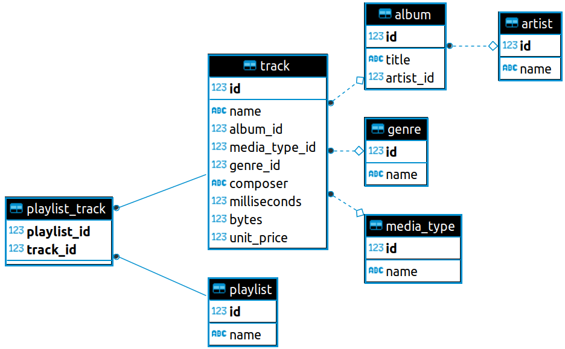

# Track store

Track store is a Java Spring boot app for dealing with music tracks.

## Prerequisites

Create postgres database called `trackstore`. 
The syntax to create a database in PostgreSQL is:

```bash
CREATE DATABASE trackstore;
```

## Run

Usage requires maven build tool. To run application execute

```bash
mvn spring-boot:run
```

## API info

```python
API info can be seen on /swagger-ui.html#/ page
```

DATA MODEL
-----------



## Contributing
Pull requests are welcome. For major changes, please open an issue first to discuss what you would like to change.


## License
[MIT](https://choosealicense.com/licenses/mit/)